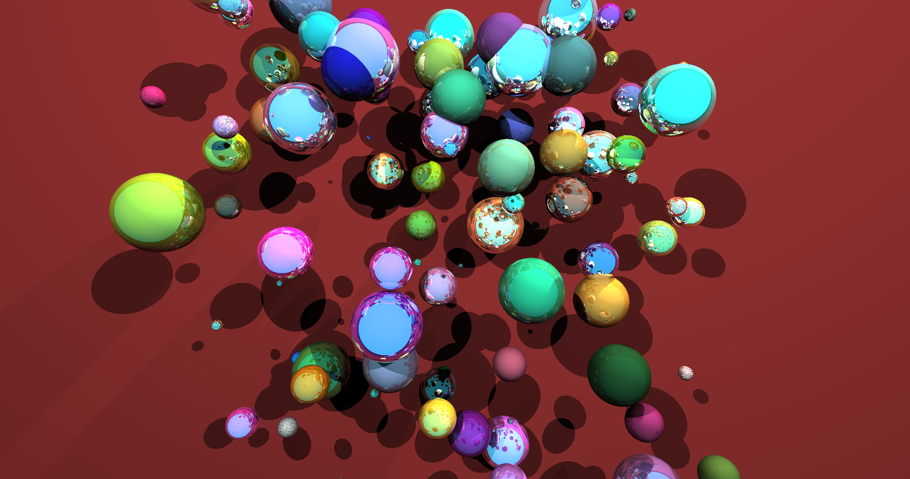
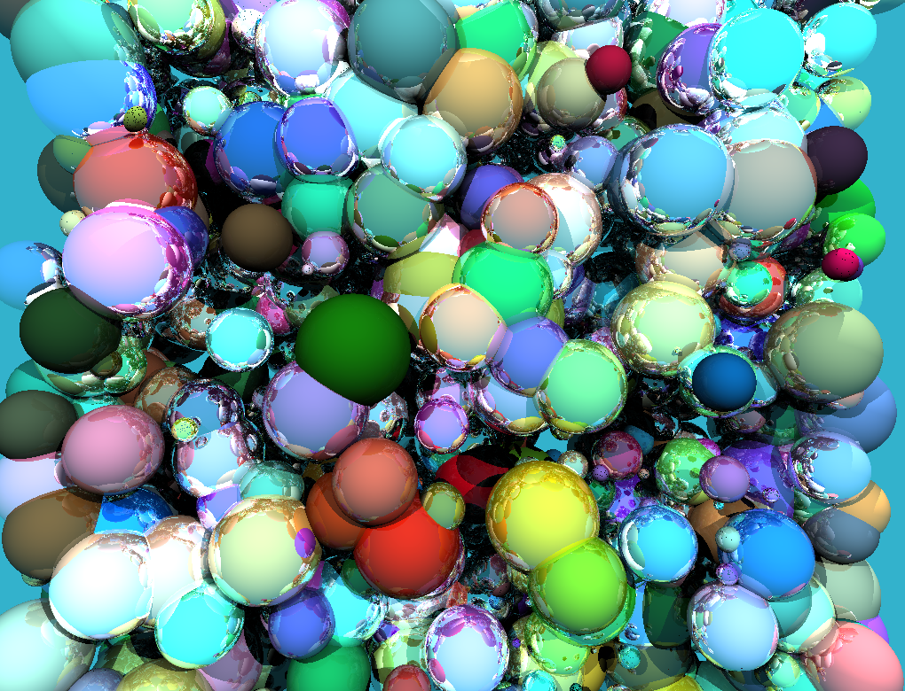
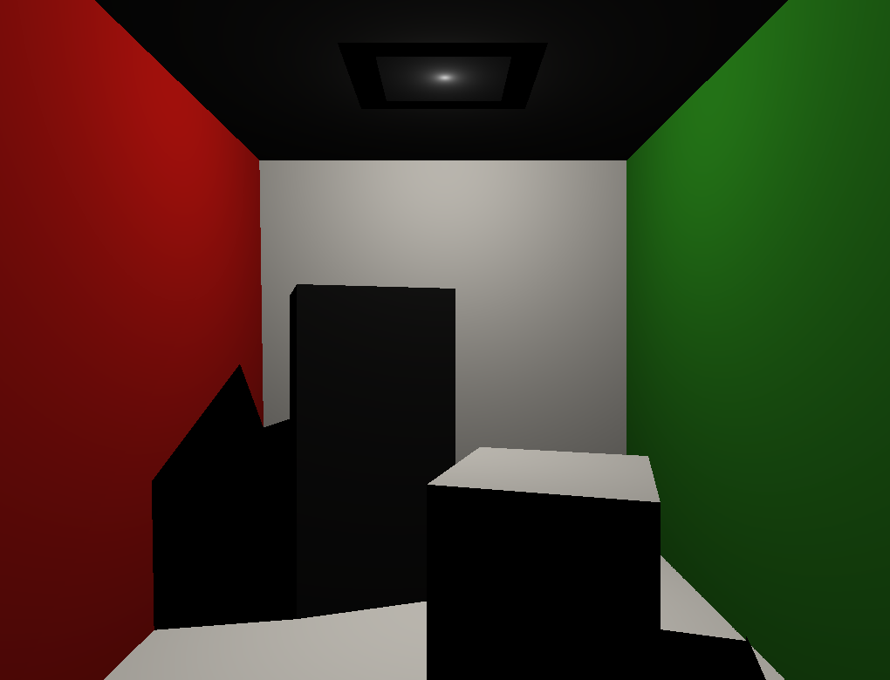
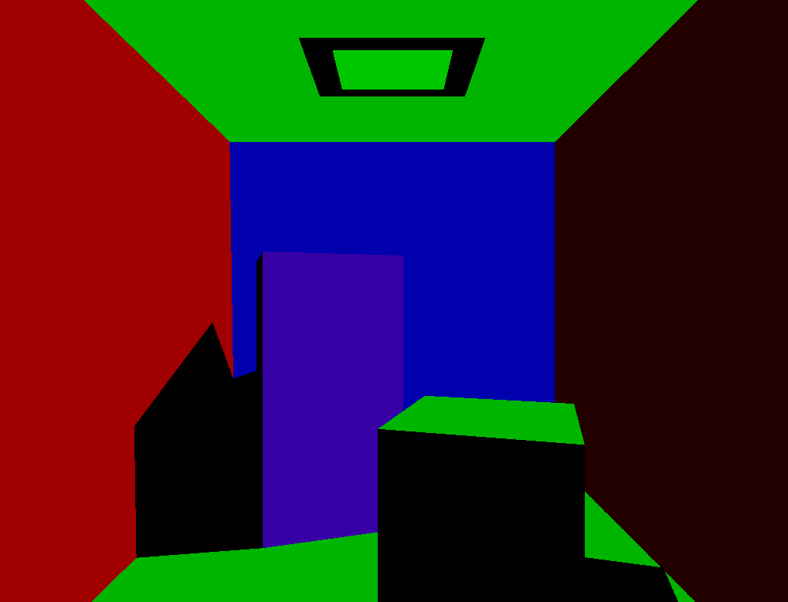
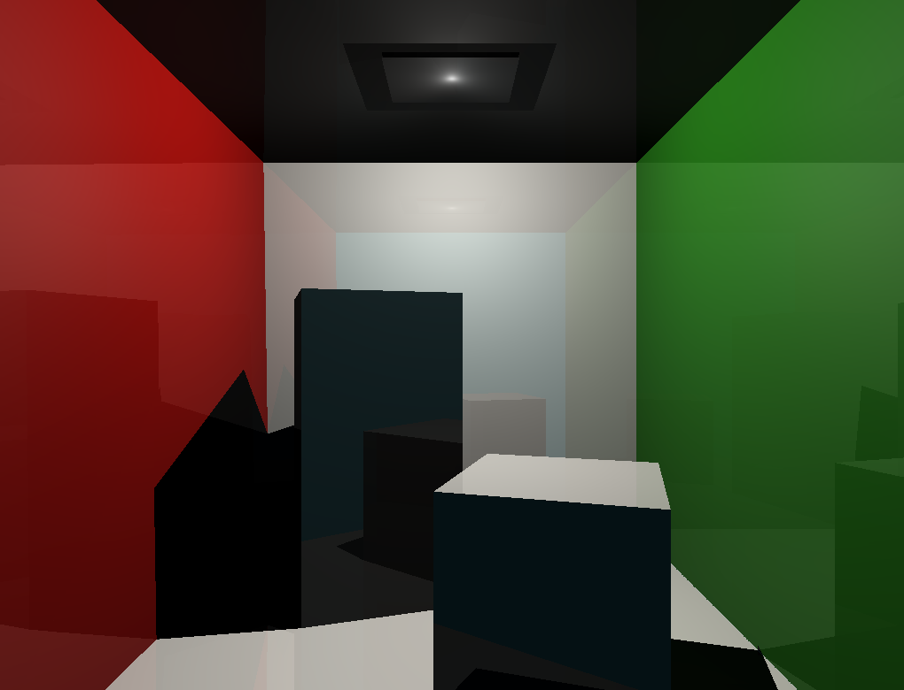
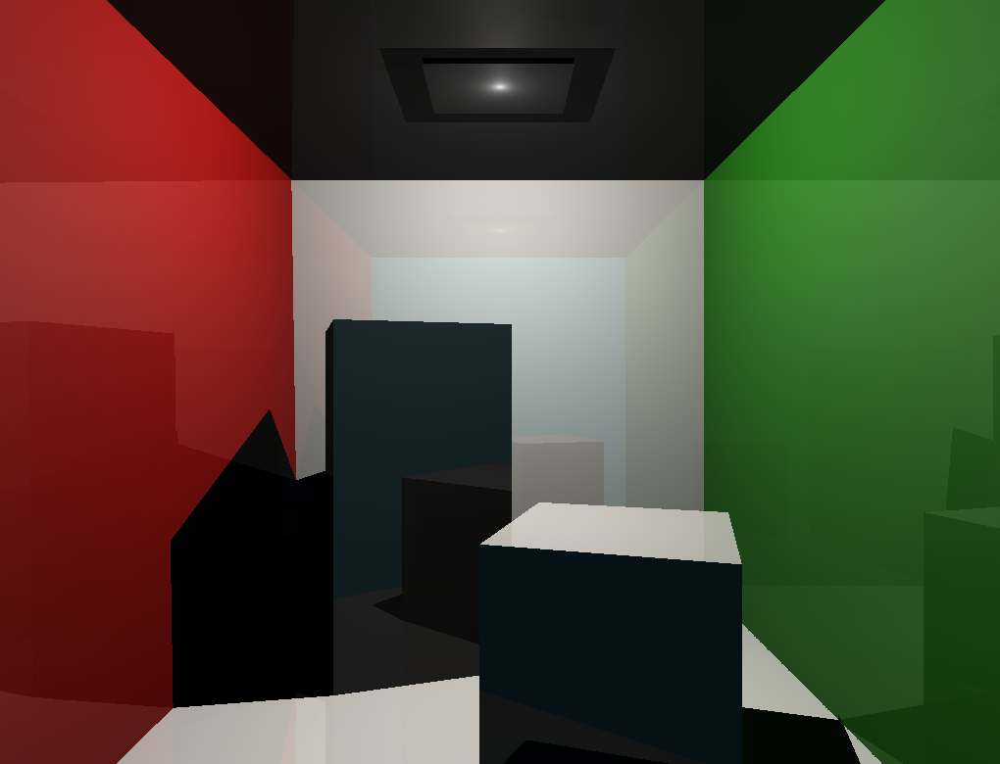
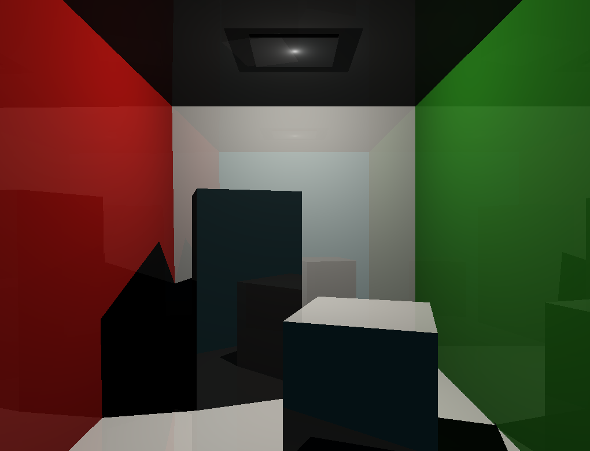

# Raytracer
A small raytracer written in C++

## Table of Contents

* [About the Project](#about-the-project)
  * [Built With](#built-with)
* [Getting Started](#getting-started)
* [Usage](#usage)
  * [Precompiled](#precompiled)
  * [Source](#source)
* [Screenshots](#screenshots)
* [License](#license)

## About The Project

This raytracer can handle a small set of basic geometry and .obj files and renders them using a variety of different BRDFs.

Current features:
* Renders spheres, planes and triangles
* Incorporates shadows
* Supports recursive reflections with maximum depth
* Multiple BRDFs (Lambertian, Phong, Blinn-Phong, Normal, Unreal Engine)
* Save images to .png

### Built With

* [stb_image_write](https://github.com/nothings/stb) - Saving renderings to file
* [tinyobjloader](https://github.com/tinyobjloader/tinyobjloader) - Load vertex data from obj files


## Getting Started

You can either download the source code and experiment with it yourself, or alternatively download a precompiled scene which randomly generates 100 spheres with random surface properties [here](https://github.com/BenCKB/Raytracer/releases).

To get the code:

  * Clone
   ```sh
  git clone https://github.com/BenCKB/Raytracer.git
   ```

  or 
  * Zip download
   ```sh
  https://github.com/BenCKB/Raytracer/archive/master.zip
   ```

## Usage

### Precompiled:
If you download the precompiled executable, it will output the image in the same directory as you run it in. 

### Source:
To render a custom scene, simply create a new scene class:
````c++
class ExampleScene : public IScene {

public:
	ExampleScene() {
    //Add objects to m_objects
    //...

    //Add lights to m_lights
    //...
	}
};
````

You can add spheres, triangles and planes:

````c++
std::shared_ptr<Sphere> sphere = std::make_shared<Sphere>(Vector3(0.f, 0.f, 0.f), 10.0f);
std::shared_ptr<Triangle> triangle = std::make_shared<Triangle>(Vector3(0.f, 0.f, 0.f), Vector3(0.f, 5.f, 0.f), Vector3(5.f, 0.f, 0.f));
std::shared_ptr<Plane> plane = std::make_shared<Plane>(Vector3(0.f, 0.f, 0.f), Vector3(0.f, 1.f, 0.f));

m_object.push_back(sphere);
m_object.push_back(triangle);
m_object.push_back(plane);
````
and/or .obj files. 

For additional information on how to include .obj files into the scene, look at `DemoScene.h` and `tiny_obj_loader.h`.

Adding lights is easy too:

````c++
std::shared_ptr<Light> light = std::make_shared<Light>(Vector3(0.0f, 0.96f, -2.2f), 1.0f)
m_lights.push_back(light);
````

Lastly, create a renderer and pass in the scene:

````c++
ExampleScene scene;
Renderer renderer(scene);
````

## Screenshots
### 100 spheres:



### 1000 spheres:



### Lambertian BRDF:



### Normal BRDF:



### Phong BRDF:



### Blinn-Phong BRDF:



### Unreal Engine BRDF:



## License

Distributed under the MIT License.